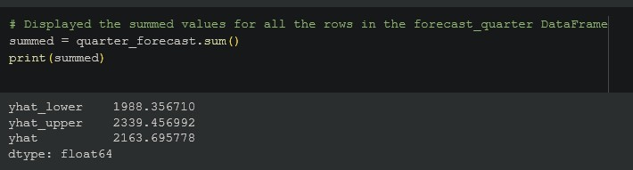

# Forecasting-Net-Prophet

In this project I processed and analyzed traffic, sales, and stock price data from MercadoLibre, an e-commerce site, using pandas and prophet. I trained prophet on the data to make various predictions about the next quarter. Below are some of the visualizations, predictions, and answers I produced.  

## Analyzing May 2020 Search Traffic

### Search Traffic for May 2020

### Comparing May 2020 Traffic to Median Monthly Traffic

**Observation:** Google search traffic increased during the month that MercadoLibre released its financial results by about 2000 hits.

## Search Seasonality

### Search Traffic by Day of Week
  
*Starts with Monday at 0*

### Heatmap displaying hourly search traffic against day of the week

**Observation:** It seems that every day of the week, traffic is concentrated between 10PM and 2AM, with extremely low traffic levels between 5AM and 11AM, and moderate levels at all other hours of the day.

### Search Traffic by Week of the Year

**Observation:** Search traffic increased during the winter holiday period (weeks 40 through 52) compared to the lows of Q3, but traffic was generally higher in Q1.

## Relating Search Traffic with Stock Price Patterns

### Search Trends and Company Stock Price

**Observation:** The rise in stock price after the crash of March 2020 was not matched by a rise in search traffic. 

I then built a correlation table between Search Trends, Closing Price, Lagged Search Trends, Stock Volatility, and Hourly Stock Returns

| Indicators      | Lagged Search Trends | 
| --------------- | ------------------- |
| Search Trends      |       0.384292  |
| Closing Price       |       0.012135  |
| Lagged Search Trends  |     1.000000  |
| Stock Volatility     |      -0.118945  |
| Hourly Stock Return   |      0.017929 |

**Observation:** It was theorized that lagged search trends would manifest as correlated with other indicators like volatility or price but no such relationship could be observed.

## Modeling Search Traffic with Prophet

### Search Trend with Forecast, weekly, yearly, & daily trends

**Observations:**
- 11PM to 2AM is the most popular time for search traffic.
- Tuesday typically has the most search results.
- The month of October is typically the lowest point in traffic for the year.

## Forecasting Revenue

### Weekly Revenue Trend

**Observation:** Wednesday is the peak revenue day of the week.

### Revenue Trend and 90 Day Forecast

### Total Forecasted Revenue for Q3

**Our best forecast is 2163.69 in revenue for Q3. The upper bound is 2339.97 and the lower bound is 1988.16**